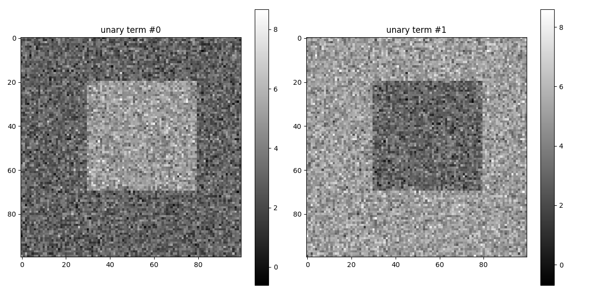
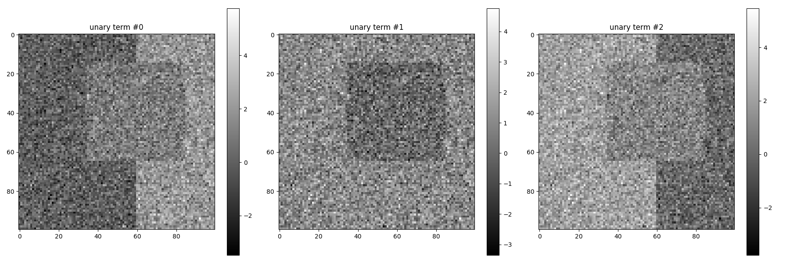

# pyGCO: a python wrapper for the graph cuts

[](https://travis-ci.org/Borda/pyGCO)
[](https://codecov.io/gh/Borda/pyGCO)
[](https://ci.appveyor.com/project/Borda/pygco)
[](https://www.codacy.com/app/Borda/pyGCO?utm_source=github.com&amp;utm_medium=referral&amp;utm_content=Borda/pyGCO&amp;utm_campaign=Badge_Grade)
[](https://app.shippable.com/github/Borda/pyGCO)
[](https://app.shippable.com/github/Borda/pyGCO)
[](https://codeclimate.com/github/Borda/pyGCO/maintainability)
[](https://app.codeship.com/projects/197423)

The original wrapper is [pygco](https://github.com/yujiali/pygco)

This is a python wrapper for [gco-v3.0 package](http://vision.csd.uwo.ca/code/), which implements a graph cuts based move-making algorithm for optimization in Markov Random Fields.

It contains a copy of the **gco-v3.0 package**.  Some of the design were borrowed from the [gco_python](https://github.com/amueller/gco_python) package. However, compared to gco_python:
* This package does not depend on Cython. Instead it is implemented using the ctypes library and a C wrapper of the C++ code.
* This package is an almost complete wrapper for gco-v3.0, which supports more direct low level control over GCoptimization objects.
* This package supports graphs with edges weighted differently.

This wrapper is composed of two parts, a C wrapper and a python wrapper.

## Implemented functions
 * **cut_general_graph**(...)
 * **cut_grid_graph**(...)
 * **cut_grid_graph_simple**(...)

## Building wrapper

1. download the last version of [gco-v3.0](http://vision.csd.uwo.ca/code/gco-v3.0.zip) to the _gco_source_
1. compile gco-v3.0 and the C wrapper using `make`
1. compile test_wrapper using `make test_wrapper`
1. run the C test code `./test_wrapper` (now you have the C wrapper ready)
```bash
make download
make all
make test_wrapper
./test_wrapper
```

The successful run should return:
```bash
labels = [ 0 2 2 1 ], energy=19
data energy=15, smooth energy=4
```

Next test the python wrapper using `python test_examples.py`, if it works fine you are ready to use pygco.

To include pygco in your code, simply import pygco module. See the documentation inside code for more details.

## Install wrapper

Clone repository and enter folder, then

```bash
pip install -r requirements.txt
python setup.py install
```

Now it can be also installed from PyPi
```bash
pip install gco-wrapper
```

## Show test results

Visualisation of the unary terns for **binary segmentation**



**4-connected** components with the initial labeling (left) and estimated labeling with regularisation **1** (middle) and **0** (right)


**8-connected** components with the initial labeling (left) and estimated labeling with regularisation **1** (middle) and **0** (right)


Visualisation of the unary terns for **3 labels segmentation**



with the __initial__ labeling (left) and __estimated__ labeling (right)


